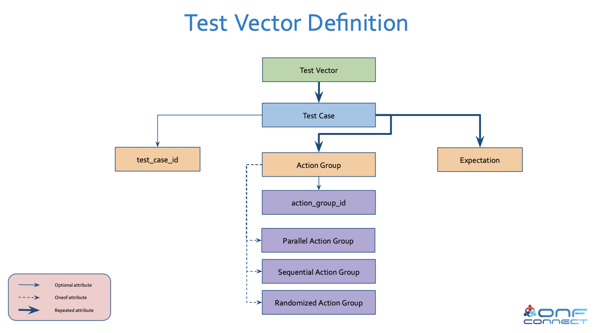
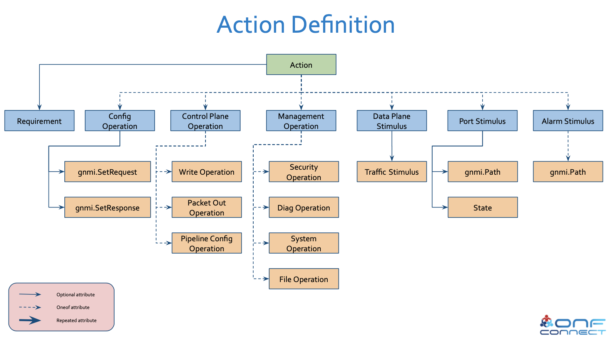
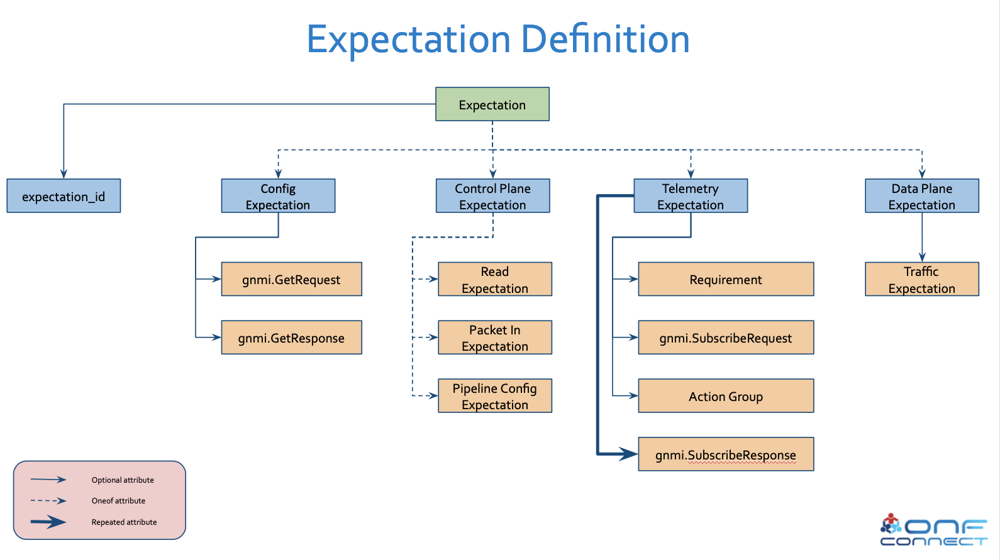

# Overview of Test Vectors

## Contents of Test Vector
The diagram below shows the high level structure of a Test Vector:

On a high level, each test vector contains:
- `test_case_id` - Unique identifier for the test case in the Test Vector.
- Multiple `Action Groups` - Each action group is set of [actions](#Contents-of-Action) that can be executed sequentially or in parallel or random order.
- Multiple [Expectations](#Contents-of-Expectation) - These are executed after all the actions are executed to verify expected system state.

## Contents of Action

Types of action supported in Test Vectors:
### Config Operation
Config operation contains `gNMI` [SetRequest](https://github.com/openconfig/gnmi/blob/89b2bf29312cda887da916d0f3a32c1624b7935f/proto/gnmi/gnmi.proto#L337) and `gNMI` [SetResponse](https://github.com/openconfig/gnmi/blob/89b2bf29312cda887da916d0f3a32c1624b7935f/proto/gnmi/gnmi.proto#L354) for performing port speed change, port admin state change, config state change etc and for verifying corresponding RPC response.

### Control Plane Operation
Control plane operation supports various `P4Runtime` operations.
- `Write Operation` contains `P4` [WriteRequest](https://github.com/abhilashendurthi/p4runtime/blob/faca11df04772001b118064a342051df244c69ee/proto/p4/v1/p4runtime.proto#L60) for sending all the forwarding entries, and `P4` [Write_Response](https://github.com/abhilashendurthi/p4runtime/blob/faca11df04772001b118064a342051df244c69ee/proto/p4/v1/p4runtime.proto#L96) for verifying corresponding RPC response.
- `Packet Out Operation` contains `P4` [PacketOut](https://github.com/abhilashendurthi/p4runtime/blob/faca11df04772001b118064a342051df244c69ee/proto/p4/v1/p4runtime.proto#L481) for sending packet to switching chip via its CPU port. It also contains other attributes such as `num_of_packets` to be sent out, `min_speed_bps`, `max_speed_bps` at which packets will be sent to the CPU port, and `cos`- class of service for the packets.
- `Pipeline Config Operation` contains `P4` [SetForwardingPipelineConfigRequest](https://github.com/abhilashendurthi/p4runtime/blob/faca11df04772001b118064a342051df244c69ee/proto/p4/v1/p4runtime.proto#L585) to push to the switch for setting the config via P4Runtime API, and `P4` [SetForwardingPipelineConfigResponse](https://github.com/abhilashendurthi/p4runtime/blob/faca11df04772001b118064a342051df244c69ee/proto/p4/v1/p4runtime.proto#L626) for verifying corresponding RPC response.

### Management Operation
[TODO]

### Data Plane Stimulus
Data plane stimulus is an external operation to send traffic to data plane port. It contains `TrafficStimulus` which has various attributes. `device_id` defined in the pipeline config pushed beforehand, `port` to send the packets to, Multiple `Packets` to be sent one after the other to the port, `num_of replicas` of the packet, `min_speed_bps`, `max_speed_bps` at which packets will be generated, and `cos`- class of service for the packets.  

### Port Stimulus
[TODO]

### Alarm Stimulus
[TODO]

## Contents of Expectation

Types of expectation supported in Test Vectors:
### Config Expectation
Config expectation has `gNMI` [GetRequest](https://github.com/openconfig/gnmi/blob/89b2bf29312cda887da916d0f3a32c1624b7935f/proto/gnmi/gnmi.proto#L393) containing data elements and `gNMI` [GetResponse](https://github.com/openconfig/gnmi/blob/89b2bf29312cda887da916d0f3a32c1624b7935f/proto/gnmi/gnmi.proto#L418) containing expected RPC response with data values requested in the GetRequest.
### Control Plane Expectation
Control plane expectation supports various `P4Runtime` get operations.
- `Read Expectation` contains `P4` [ReadRequest](https://github.com/abhilashendurthi/p4runtime/blob/faca11df04772001b118064a342051df244c69ee/proto/p4/v1/p4runtime.proto#L99) for fetching entries from switch and multiple `P4` [ReadResponse](https://github.com/abhilashendurthi/p4runtime/blob/faca11df04772001b118064a342051df244c69ee/proto/p4/v1/p4runtime.proto#L104)s expected as result of the RPC.
- `Packet In Expectation` contains `P4` [PacketIn](https://github.com/abhilashendurthi/p4runtime/blob/faca11df04772001b118064a342051df244c69ee/proto/p4/v1/p4runtime.proto#L509) for receiving packet from switching chip on its CPU port. It also contains other attributes such as `num_of_packets` to be received, `min_speed_bps`, `max_speed_bps` at which packets will be received at the CPU port, and `cos`- class of service for the packets.
- `Pipeline Config Expectation` contains `P4` [GetForwardingPipelineConfigRequest](https://github.com/abhilashendurthi/p4runtime/blob/faca11df04772001b118064a342051df244c69ee/proto/p4/v1/p4runtime.proto#L646) to fetch the pipeline config from the switch via P4Runtime API, and `P4` [GetForwardingPipelineConfigResponse](https://github.com/abhilashendurthi/p4runtime/blob/faca11df04772001b118064a342051df244c69ee/proto/p4/v1/p4runtime.proto#L663) for verifying corresponding RPC response.
### Telemetry Expectation
Telemetry expectation is used to test gNMI subscription operation. As part of this, a subscription channel is opened with one subscribe request, optionally some actions are performed and all the subscription responses received on the channel are verified. 
Telemetry expectation contains single `gNMI` [SubscribeRequest](https://github.com/openconfig/gnmi/blob/89b2bf29312cda887da916d0f3a32c1624b7935f/proto/gnmi/gnmi.proto#L206) to send over the stream, an `ActionGroup` with set of actions to be run after the subscription stream is created and request has been sent, multiple `gNMI` [SubscribeResponses](https://github.com/openconfig/gnmi/blob/89b2bf29312cda887da916d0f3a32c1624b7935f/proto/gnmi/gnmi.proto#L230) to be verified as soon as the subscription stream is created. The order of responses should match the order of the messages read from channel. To enforce a specific time limit for receiving all the responses and closing the channel, `Requirement`[TODO] attribute is defined.
### Data Plane Expectation
Data plane expectation is an external expectation to receive traffic from one of the data plane ports. It contains `TrafficExpectation` which has various attributes. `device_id` defined in the pipeline config pushed beforehand, multiple `ports` from which output packets may come out, Multiple `Packets` to be received on the port(s), `num_of replicas` of the packet, `min_speed_bps`, `max_speed_bps` at which packets will be received, `cos`- class of service for the packets, and `Distribution`(TODO) in case packets are sent to an ECMP group.  
